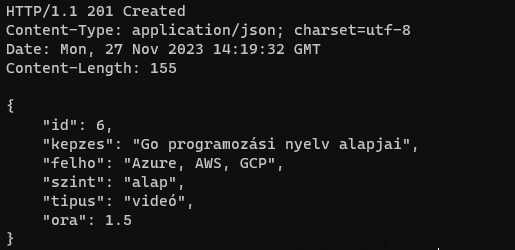

# Go - Web Szolgáltatás (middleware)

Olyan Web szolgáltatást írunk itt, ahol a képernyőn megjelenítünk valamilyen adatot. Ez esetben a Mentork Klubnál elérhető Felhő képzések adatait írjuk ki a képernyőre JSON formátumban.
Ezáltal már bármilyen webalkalmazás képes lesz ezt az adatot felolvasni és grafikusan megjeleníteni.

## Előfeltételek

Az alábbi helyen megtalálod az előkészületeket a Go-ban való fejlesztéshez: https://github.com/cloudsteak/golang-basics

## Projekt létrehozás

1. Nyiss egy parancssort (CMD)
2. Navigálj abba a mappába ahol a kódod fogod tárolni a helyi gépeden.
3. Hozd létre a projekted mappáját. Pl.: `webszolgaltatas`

```bash
mkdir webszolgaltatas
```

4. Lépj be a mappába

```bash
cd webszolgaltatas
```

5. Készítsd el a projekted alap struktúráját

```bash
go mod init webszolgaltatas
```

6. indítsd el innen a Visual Studio Code-ot.

```bash
code .
```

## Go alkalmazás

1. Hozd létre a `main.go` fájlt a projekt gyökerében
2. A szerkesztőben a `main.go` fülön, ked el gépelni: `package`
3. A VS Code felajánl több lehetőséget is. Nekünk jelnleg a `package main` szükséges
4. Hozzuk létre a megjelenítendő adatokat struktúráját (ez lesz a képzés típusa). Illeszd az alábbi kódot a `package main` alá:

```go
type kepzes struct {
	ID     int     `json:"id"`     // Képzés azonosítója
	Kepzes string  `json:"kepzes"` // Képzés neve
	Felho  string  `json:"felho"`  // Melyik felhővel kaplcsolatos a képzés
	Szint  string  `json:"szint"`  // Milyen szintű a képzés
	Tipus  string  `json:"tipus"`  // Milyen formátumban elérhető
	Ora    float64 `json:"ora"`    // Milyen kiterjedésű
}
```

5. Ez alapján definiáljuk az adatot (jelenleg innen a kódból):

```go
// Képzések adatai egyben - Jelenleg helyben definiálva
var kepzesek = []kepzes{
	{ID: 1, Kepzes: "Cloud alapozó - AWS, Azure", Felho: "AWS, Azure", Szint: "alap", Tipus: "video", Ora: 3},
	{ID: 2, Kepzes: "Cloud alapozó - Azure", Felho: "Azure", Szint: "alap", Tipus: "egy napos", Ora: 7},
	{ID: 3, Kepzes: "Cloud alapozó - AWS", Felho: "AWS", Szint: "alap", Tipus: "egy napos", Ora: 7},
	{ID: 4, Kepzes: "Haladó Cloud - Azure 7 hetes képzés", Felho: "Azure", Szint: "haladó", Tipus: "7 hetes", Ora: 10.5},
	{ID: 5, Kepzes: "Azure haladó szinten", Felho: "Azure", Szint: "haladó", Tipus: "videó", Ora: 9},
}
```

6. Hozzunk létre egy függvényt, amely lekérdezi a képzéseket az adathalmazból

```go
// Függvény, amely visszadja a képzések listáját az elérhető adathalmazból
func kepzesLista(c *gin.Context) {
	c.IndentedJSON(http.StatusOK, kepzesek)
}
```

7. Ez alá a sor alá pedig illeszd be az alábbi fő függvényt, ami már a web szolgáltatás része az alkalmazásunknak:

```go
// Fő függvény - az alkalmazás belépési pontja.
// Web alkalmazás definiálása, amely a /kepzesek ág meghívása esetén meghívja a képzések listázása függvényt
func main() {
	router := gin.Default()
	router.GET("/kepzesek", kepzesLista)
	// Az alkalmatás elérhető a 8080-as porton
	router.Run("localhost:8080")
}
```

8. A `package main` sor alá szúrd be az alábbi függőség kezelést

```go
import (
	"net/http"

	"github.com/gin-gonic/gin"
)
```

9. Mentsd el a módosításokat

10. A Go érzékeli, hogy van csomag függőség és pár másodperc múlva jelzi, hogy hiányzik és módosítja a kódot ennek megfeleően. Vagy jelzi ha hiányzik egy csomag és azt telepíteni kell.

11. Futtasd az alábbi parancsot, hogy letöltődjenek a megfelelő csomagok:

```bash
go get .
```

12. Amikor végzett, eltűnik a kódból a figyelmeztetés. Ez lesz a `main.go` tartalma

```go
package main

import (
	"net/http"

	"github.com/gin-gonic/gin"
)

type kepzes struct {
	ID     int     `json:"id"`     // Képzés azonosítója
	Kepzes string  `json:"kepzes"` // Képzés neve
	Felho  string  `json:"felho"`  // Melyik felhővel kaplcsolatos a képzés
	Szint  string  `json:"szint"`  // Milyen szintű a képzés
	Tipus  string  `json:"tipus"`  // Milyen formátumban elérhető
	Ora    float64 `json:"ora"`    // Milyen kiterjedésű
}

// Képzések adatai egyben - Jelenleg helyben definiálva
var kepzesek = []kepzes{
	{ID: 1, Kepzes: "Cloud alapozó - AWS, Azure", Felho: "AWS, Azure", Szint: "alap", Tipus: "video", Ora: 3},
	{ID: 2, Kepzes: "Cloud alapozó - Azure", Felho: "Azure", Szint: "alap", Tipus: "egy napos", Ora: 7},
	{ID: 3, Kepzes: "Cloud alapozó - AWS", Felho: "AWS", Szint: "alap", Tipus: "egy napos", Ora: 7},
	{ID: 4, Kepzes: "Haladó Cloud - Azure 7 hetes képzés", Felho: "Azure", Szint: "haladó", Tipus: "7 hetes", Ora: 10.5},
	{ID: 5, Kepzes: "Azure haladó szinten", Felho: "Azure", Szint: "haladó", Tipus: "videó", Ora: 9},
}

// Függvény, amely visszadja a képzések listáját az elérhető adathalmazból
func kepzesLista(c *gin.Context) {
	c.IndentedJSON(http.StatusOK, kepzesek)
}

// Fő függvény - az alkalmazás belépési pontja.
// Web alkalmazás definiálása, amely a /kepzesek ág meghívása esetén meghívja a képzések listázása függvényt
func main() {
	router := gin.Default()
	router.GET("/kepzesek", kepzesLista)
	// Az alkalmatás elérhető a 8080-as porton
	router.Run("localhost:8080")
}

```

Megjegyzés: Nem minden csomagot tud automatikusan telepíteni a Go. Tehát van amit majd külön parancsok futtatásával kell telepítneni.

## Alkalmazás futtatása

1. A megírt kódot az alábbi paranccsal tudjuk futtani a project fő mappájából: `go run .` vagy `go run main.go`
2. Ha megjelenik a terminal-ban a `[GIN-debug] Listening and serving HTTP on localhost:8080` az alkalmazás készen áll a használatra
3. Egy böngésző ablakban nyisd meg a http://localhost:8080

Eredmény:

```html
404 page not found
```

4. Ez normális, hiszen a képzések listája az alábbi linken érhető el: http://localhost:8080/kepzesek

Eredmény:

```json
[
  {
    "id": 1,
    "kepzes": "Cloud alapozó - AWS, Azure",
    "felho": "AWS, Azure",
    "szint": "alap",
    "tipus": "video",
    "ora": 3
  },
  {
    "id": 2,
    "kepzes": "Cloud alapozó - Azure",
    "felho": "Azure",
    "szint": "alap",
    "tipus": "egy napos",
    "ora": 7
  },
  {
    "id": 3,
    "kepzes": "Cloud alapozó - AWS",
    "felho": "AWS",
    "szint": "alap",
    "tipus": "egy napos",
    "ora": 7
  },
  {
    "id": 4,
    "kepzes": "Haladó Cloud - Azure 7 hetes képzés",
    "felho": "Azure",
    "szint": "haladó",
    "tipus": "7 hetes",
    "ora": 10.5
  },
  {
    "id": 5,
    "kepzes": "Azure haladó szinten",
    "felho": "Azure",
    "szint": "haladó",
    "tipus": "videó",
    "ora": 9
  }
]
```

## Alkalmazás fordítása (build)

Ha szeretnénk az alkalmazásunkat máshol is futtatni, anélkül, hogy minden fejlesztői eszközt és függőséget telepíteni kellene, akkor azt egy csomagba le is tudjuk fordítani (build). Ehhez az alábbi parancsot kell futtatni: `go build`

Eredményképpen Windows-on egy exe fájlt kapunk, amit futtathatunk a Go fejlesztői környezewten kívül is.

## Új elem hozzáadása a meglévő képzési listához

1. Adjunk hozzá egy új függvényt, ami új képzét ad hozzá a meglévőekhez (másoljuk ezt a `kepzesLista` függvény után)

```go
// kepzesUj segítségével egy új elemet adhatunk a képzési listánkhoz
func kepzesUj(c *gin.Context) {
	var ujKepzes kepzes

	// ujKepzes
	if err := c.BindJSON(&ujKepzes); err != nil {
		// Hibakezelés
		return
	}

	// Adjuk hozzá az új képzést a már meglévőekhez
	kepzesek = append(kepzesek, ujKepzes)
	c.IndentedJSON(http.StatusCreated, ujKepzes)
}
```

2. Módosítsuk a `main` függvényt, hogy lekezelje az új függvényt. (Új sor: `router.POST("/kepzesek", kepzesUj)`)

```go
// Fő függvény - az alkalmazás belépési pontja.
// Web alkalmazás definiálása, amely a /kepzesek ág meghívása esetén meghívja a képzések listázása függvényt
func main() {
	router := gin.Default()
	// Képzések lekérdezése
	router.GET("/kepzesek", kepzesLista)
	// Új képzés
	router.POST("/kepzesek", kepzesUj)
	// Az alkalmatás elérhető a 8080-as porton
	router.Run("localhost:8080")
}
```

3. A megírt kódot az alábbi paranccsal tudjuk futtani a project fő mappájából: `go run .` vagy `go run main.go`
4. Ha megjelenik a terminal-ban a `[GIN-debug] Listening and serving HTTP on localhost:8080` az alkalmazás készen áll a használatra
5. Egy böngésző ablakban nyisd meg a http://localhost:8080/kepzesek

Eredmény: ugyanaz lesz mint korábban, hiszen még nem adtunk hozzá új képzést

6. Új képzés hozzáadásához nyissunk egy új terminál-t vagy parancssort (CMD)
7. Illeszük bele az alábbi kódot:

```bash
curl -i -H "Content-Type: application/json" -X POST -d "{\"id\": 6, \"kepzes\": \"Go programozási nyelv alapjai\", \"felho\": \"Azure, AWS, GCP\", \"szint\": \"alap\", \"tipus\": \"videó\", \"ora\": 1.5}" http://localhost:8080/kepzesek
```

Eredmény:



8. Most frissítsünk rá a böngészőnkben. a http://localhost:8080/kepzesek linkre (megjelent az új képzés)

Eredmény:

```json
[
  {
    "id": 1,
    "kepzes": "Cloud alapozó - AWS, Azure",
    "felho": "AWS, Azure",
    "szint": "alap",
    "tipus": "video",
    "ora": 3
  },
  {
    "id": 2,
    "kepzes": "Cloud alapozó - Azure",
    "felho": "Azure",
    "szint": "alap",
    "tipus": "egy napos",
    "ora": 7
  },
  {
    "id": 3,
    "kepzes": "Cloud alapozó - AWS",
    "felho": "AWS",
    "szint": "alap",
    "tipus": "egy napos",
    "ora": 7
  },
  {
    "id": 4,
    "kepzes": "Haladó Cloud - Azure 7 hetes képzés",
    "felho": "Azure",
    "szint": "haladó",
    "tipus": "7 hetes",
    "ora": 10.5
  },
  {
    "id": 5,
    "kepzes": "Azure haladó szinten",
    "felho": "Azure",
    "szint": "haladó",
    "tipus": "videó",
    "ora": 9
  },
  {
    "id": 6,
    "kepzes": "Go programozási nyelv alapjai",
    "felho": "Azure, AWS, GCP",
    "szint": "alap",
    "tipus": "videó",
    "ora": 1.5
  }
]
```

## Adatok megnyitása fájlból

Közelebb van a valósághoz, ha az adatokat az alkalmazáson kívülről olvassuk. Jelen esetben ez egy json fájl lesz

1. Módosítsuk a képzés adataihoz tartozó váltózók definiálsát az alábbiak szerint:

```go
// Képzések adatai egyben - csak üresen
var kepzesek = []kepzes{}
```

2. Hozzunk létre egy fügvényt, ami felolvassa az adatokat fájlból, mad átalakítja a megfelelő formátumra. Illesszük be a `var képzések` sor alá:

```go
// Adatok olvasása fájlból
func adatOlvasas(dataFajl string) {
	// Adatfájl megnyitása
	jsonFajl, err := os.Open(dataFajl)
	// Hibakezelés, ha valamiért nem sikerül megnyitni a fájlt
	if err != nil {
		log.Fatalln(err)
	}

	// Értékek kiolvasása byte tipusba
	byteErtekek, _ := io.ReadAll(jsonFajl)

	// Átalakítás JSON formátumra
	json.Unmarshal(byteErtekek, &kepzesek)

	log.Printf("%s sikeresen megnyitva\n", dataFajl)
	// Fájl lezárása
	defer jsonFajl.Close()
}
```

3. Végül módosítsuk a fő függvényt is, hogy induláskor megtörténjen a fájl beolvasása. Add a következő sort a `main()` első sorába:

```go
	// Adatok beolvasása
	adatOlvasas("data.json")
```
4. Mentsük el a változásokat. 

Most így néz ki a kódunk:

```go
package main

import (
	"encoding/json"
	"io"
	"log"
	"net/http"
	"os"

	"github.com/gin-gonic/gin"
)

type kepzes struct {
	ID     int     `json:"id"`     // Képzés azonosítója
	Kepzes string  `json:"kepzes"` // Képzés neve
	Felho  string  `json:"felho"`  // Melyik felhővel kaplcsolatos a képzés
	Szint  string  `json:"szint"`  // Milyen szintű a képzés
	Tipus  string  `json:"tipus"`  // Milyen formátumban elérhető
	Ora    float64 `json:"ora"`    // Milyen kiterjedésű
}

// Képzések adatai egyben - Jelenleg helyben definiálva
var kepzesek = []kepzes{}

// Adatok olvasása fájlból
func adatOlvasas(dataFajl string) {
	// Adatfájl megnyitása
	jsonFajl, err := os.Open(dataFajl)
	// Hibakezelés, ha valamiért nem sikerül megnyitni a fájlt
	if err != nil {
		log.Fatalln(err)
	}

	// Értékek kiolvasása byte tipusba
	byteErtekek, _ := io.ReadAll(jsonFajl)

	// Átalakítás JSON formátumra
	json.Unmarshal(byteErtekek, &kepzesek)

	log.Printf("%s sikeresen megnyitva\n", dataFajl)
	// Fájl lezárása
	defer jsonFajl.Close()
}

// Függvény, amely visszadja a képzések listáját az elérhető adathalmazból
func kepzesLista(c *gin.Context) {
	c.IndentedJSON(http.StatusOK, kepzesek)
}

// kepzesUj segítségével egy új elemet adhatunk a képzési listánkhoz
func kepzesUj(c *gin.Context) {
	var ujKepzes kepzes

	// ujKepzes
	if err := c.BindJSON(&ujKepzes); err != nil {
		// Hibakezelés
		return
	}

	// Adjuk hozzá az új képzést a már meglévőekhez
	kepzesek = append(kepzesek, ujKepzes)
	c.IndentedJSON(http.StatusCreated, ujKepzes)
}

// Fő függvény - az alkalmazás belépési pontja.
// Web alkalmazás definiálása, amely a /kepzesek ág meghívása esetén meghívja a képzések listázása függvényt
func main() {
	// Adatok beolvasása
	adatOlvasas("data.json")
	router := gin.Default()
	// Képzések lekérdezése
	router.GET("/kepzesek", kepzesLista)
	// Új képzés
	router.POST("/kepzesek", kepzesUj)
	// Az alkalmatás elérhető a 8080-as porton
	router.Run("localhost:8080")
}

```

Megjegyzés: futtathatjuk, ahogy már tanultuk. Fordítás is működik. Adat fájl neve: `data.json`


## Meglévő kód használata

1. Terminalban belépek a projekt mappába
2. Terminal-ban lefuttatom az alábbi parancsot:

```bash
go get .
```
